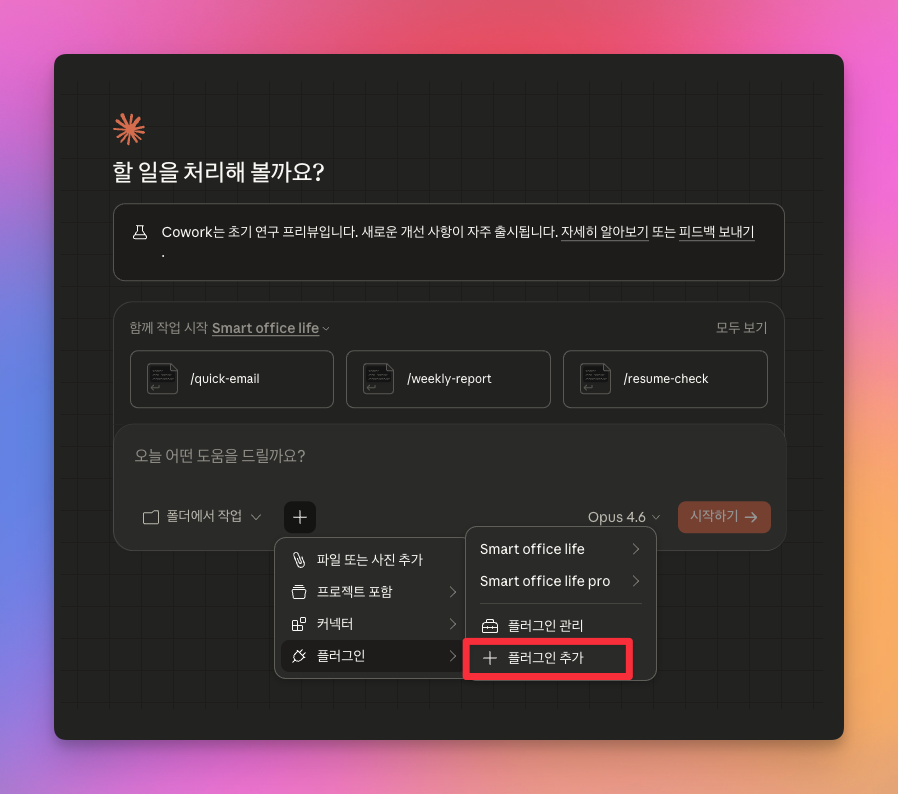
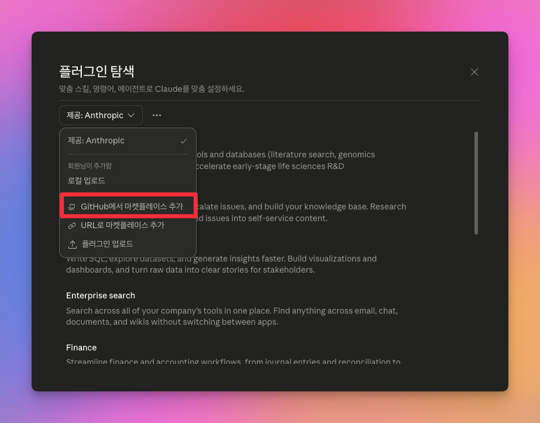
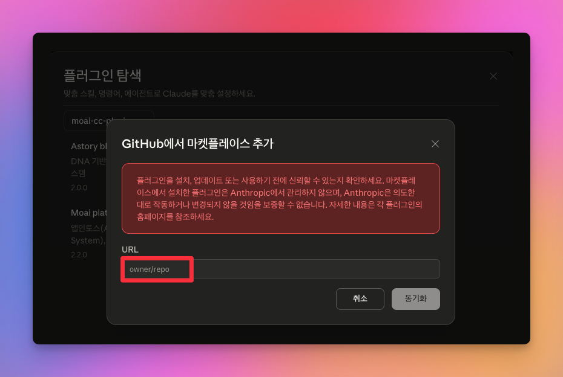

# 슬기로운 코워크 생활 — Claude Cowork 플러그인 마켓플레이스

> 한국 직장인·1인사업자·취준생을 위한 AI 업무 자동화 플러그인

## 설치 방법

### Step 1. 플러그인 추가 메뉴 열기

Claude 데스크톱 앱 하단의 **+** 버튼을 클릭하고 **플러그인** → **+ 플러그인 추가**를 선택합니다.



### Step 2. GitHub 마켓플레이스 추가

**플러그인 탐색** 창이 열리면 상단의 **제공: Anthropic** 드롭다운을 클릭하고, **GitHub에서 마켓플레이스 추가**를 선택합니다.



### Step 3. URL 입력 및 동기화

**GitHub에서 마켓플레이스 추가** 다이얼로그에서 아래 주소를 입력하고 **동기화** 버튼을 클릭합니다:

```
modu-ai/smart-cowork-life
```



동기화가 완료되면 **12종 스킬**이 자동 활성화되고, **5종 슬래시 커맨드**를 `/`로 호출할 수 있습니다.

## 포함 플러그인

| 플러그인                                    | 스킬 | 커맨드 | 설명                                                    |
| ------------------------------------------- | ---- | ------ | ------------------------------------------------------- |
| **[smart-cowork-life](smart-cowork-life/)** | 12종 | 5종    | 이메일, 보고서, 회의록, 제안서, 엑셀, 번역, PPT, SVG 등 |

각 플러그인의 상세 스킬 목록과 사용 예시는 해당 폴더의 [README](smart-cowork-life/README.md)를 참고하세요.

## 만든 곳

**모두AI (https://mo.ai.kr)**

## 라이선스

COPYLEFT
