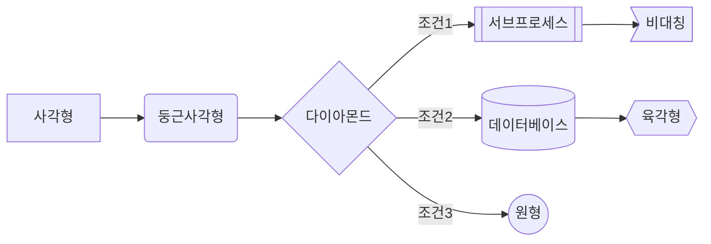
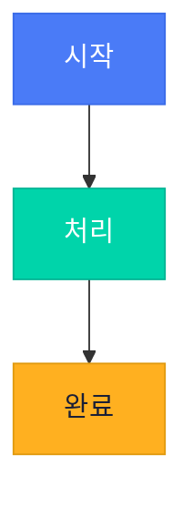
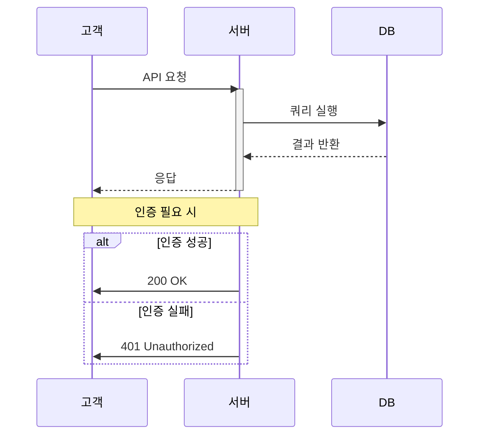
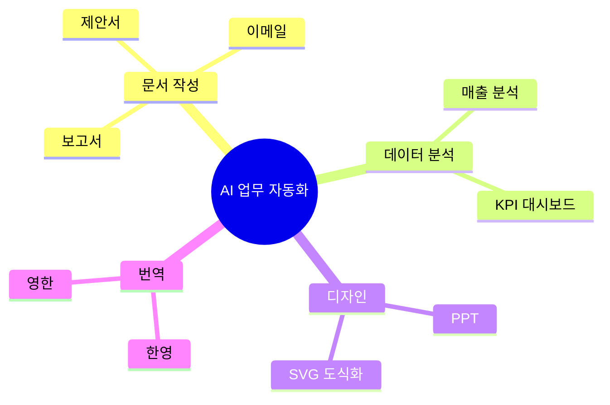
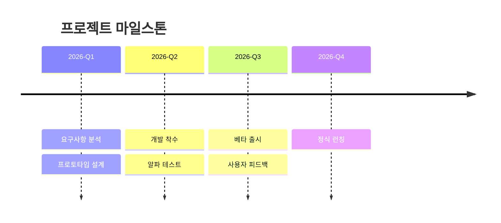
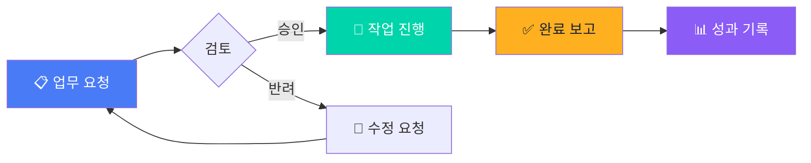
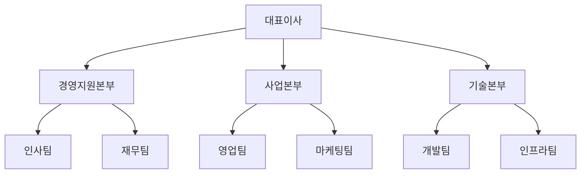
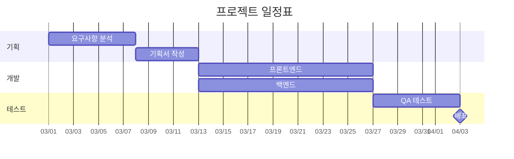

# SVG 도식화 & Mermaid 변환기

## Overview

비즈니스 문서(PPT, Word, PDF)에 삽입할 고품질 SVG 다이어그램을 생성합니다.
Mermaid 구문 → SVG 자동 변환 + 테마 색상 커스터마이징을 지원합니다.

> **환경 참고**: Mermaid CLI(`mmdc`)는 Puppeteer(Chrome)가 필요합니다.
> Cowork 환경에서는 **커스텀 SVG 직접 생성**(방법 2)을 우선 사용하세요.
> 사용자의 로컬 PC에 Chrome이 설치되어 있으면 `mmdc`도 정상 동작합니다.

## 지원 다이어그램 유형

| 유형 | 설명 | Mermaid 지원 | 커스텀 SVG |
|------|------|:----------:|:----------:|
| 플로우차트 | 업무 프로세스, 의사결정 흐름 | ✅ | ✅ |
| 조직도 | 팀 구조, 보고 체계 | ✅ | ✅ |
| 시퀀스 다이어그램 | API 흐름, 시스템 연동 | ✅ | - |
| 간트 차트 | 프로젝트 일정 | ✅ | - |
| 파이 차트 | 비율/분포 시각화 | ✅ | ✅ |
| 타임라인 | 연혁, 마일스톤 | ✅ | ✅ |
| KPI 카드 | 핵심 지표 시각화 | - | ✅ |
| 프로세스 화살표 | 단계별 진행 도식 | - | ✅ |
| 비교표 | Before/After, vs 비교 | - | ✅ |
| 인포그래픽 | 통계, 데이터 시각화 | - | ✅ |

## 테마 색상 시스템

### 기본 팔레트 (ppt-design-system 연동)

```javascript
const THEME = {
  primary:    '#4A7BF7',  // 메인 블루
  secondary:  '#00D4AA',  // 시안 그린
  accent:     '#FFB020',  // 골드 옐로우
  danger:     '#FF6B6B',  // 레드
  purple:     '#8B5CF6',  // 퍼플
  dark:       '#1A1F36',  // 다크 네이비
  text:       '#4A5568',  // 본문 그레이
  light:      '#F5F7FA',  // 배경 그레이
  white:      '#FFFFFF',
};
```

## Mermaid 공식 문법 레퍼런스 (v11.x)

> 참고: https://mermaid.js.org/intro/syntax-reference.html

### 지원 다이어그램 목록

| 다이어그램 | 키워드 | 용도 |
|-----------|--------|------|
| 플로우차트 | `flowchart LR/TD/BT/RL` | 업무 프로세스, 의사결정 |
| 시퀀스 | `sequenceDiagram` | API/시스템 연동 흐름 |
| 클래스 | `classDiagram` | 시스템 구조, 관계도 |
| 상태 | `stateDiagram-v2` | 상태 전이, 워크플로우 |
| ER | `erDiagram` | 데이터베이스 구조 |
| 간트 | `gantt` | 프로젝트 일정 |
| 파이 | `pie` | 비율/분포 |
| 마인드맵 | `mindmap` | 아이디어 정리, 브레인스토밍 |
| 타임라인 | `timeline` | 연혁, 마일스톤 |
| Git 그래프 | `gitGraph` | 브랜치 전략 |
| 블록 | `block-beta` | 시스템 아키텍처 |
| 산키 | `sankey-beta` | 흐름량 시각화 |

### Look & Layout 설정 (v11 신기능)

Mermaid v11부터 다이어그램의 외형(look)과 레이아웃(layout)을 선택할 수 있습니다.

```yaml
---
config:
  look: handDrawn    # classic | handDrawn
  layout: elk        # dagre | elk
  theme: base
---
flowchart LR
    A[요청] --> B[처리] --> C[완료]
```

- **handDrawn**: 스케치 느낌 (비공식 미팅, 아이디어 단계)
- **classic**: 기존 깔끔한 스타일 (공식 문서, 보고서)
- **ELK layout**: 복잡한 다이어그램에 최적화된 레이아웃 엔진

### 플로우차트 노드 형태



### 스타일링 (classDef)



### 시퀀스 다이어그램 문법



### 마인드맵 (v11)



### 타임라인



## 방법 1: Mermaid → SVG 변환

### 설치 및 사용

```bash
# mermaid-cli 설치 (이미 설치됨)
npx mmdc --version

# Mermaid 파일 → SVG 변환
npx mmdc -i diagram.mmd -o diagram.svg -t dark -b transparent
```

### Mermaid 변환 스크립트

```javascript
const { execSync } = require('child_process');
const fs = require('fs');
const path = require('path');

/**
 * Mermaid 구문을 SVG로 변환
 * @param {string} mermaidCode - Mermaid 구문
 * @param {string} outputPath - 출력 SVG 경로
 * @param {object} options - 옵션 (theme, bgColor, width, height)
 */
function mermaidToSvg(mermaidCode, outputPath, options = {}) {
  const tmpInput = '/tmp/mermaid_input.mmd';
  const tmpConfig = '/tmp/mermaid_config.json';
  
  // Mermaid 코드 저장
  fs.writeFileSync(tmpInput, mermaidCode, 'utf8');
  
  // 테마 설정 (한국형 비즈니스 색상)
  const config = {
    theme: 'base',
    themeVariables: {
      primaryColor: options.primaryColor || '#4A7BF7',
      primaryTextColor: '#FFFFFF',
      primaryBorderColor: '#3A6BE7',
      secondaryColor: options.secondaryColor || '#00D4AA',
      tertiaryColor: '#F5F7FA',
      lineColor: '#4A5568',
      textColor: '#1A1F36',
      fontSize: '14px',
      fontFamily: 'Pretendard, "ChosunilboNM", sans-serif',
      // 노드 스타일
      nodeBorder: '2px',
      nodeTextColor: '#1A1F36',
      mainBkg: '#EBF0FF',
      // 간트 차트
      gridColor: '#E2E8F0',
      todayLineColor: '#FF6B6B',
      // 시퀀스
      actorBkg: '#4A7BF7',
      actorTextColor: '#FFFFFF',
      activationBkgColor: '#E8EEFF',
    }
  };
  
  fs.writeFileSync(tmpConfig, JSON.stringify(config), 'utf8');
  
  // 변환 실행
  const cmd = [
    'npx', 'mmdc',
    '-i', tmpInput,
    '-o', outputPath,
    '-c', tmpConfig,
    '-b', options.bgColor || 'transparent',
    '-w', String(options.width || 1200),
    '-H', String(options.height || 800),
  ].join(' ');
  
  execSync(cmd, { timeout: 30000 });
  
  // SVG 후처리: 한글 폰트 확보
  let svg = fs.readFileSync(outputPath, 'utf8');
  if (!svg.includes('Pretendard')) {
    svg = svg.replace(
      '<style>',
      `<style>
        @import url('https://cdn.jsdelivr.net/gh/orioncactus/pretendard/dist/web/static/pretendard.css');
      `
    );
    fs.writeFileSync(outputPath, svg, 'utf8');
  }
  
  return outputPath;
}
```

### Mermaid 템플릿 예시

#### 업무 프로세스 플로우


#### 조직도


#### 프로젝트 간트 차트


## 방법 2: 커스텀 SVG 직접 생성

### SVG 기본 구조

```javascript
function createSvg(width, height, content) {
  return `<?xml version="1.0" encoding="UTF-8"?>
<svg xmlns="http://www.w3.org/2000/svg" 
     viewBox="0 0 ${width} ${height}" 
     width="${width}" height="${height}">
  <defs>
    <style>
      @import url('https://cdn.jsdelivr.net/gh/orioncactus/pretendard/dist/web/static/pretendard.css');
      text { font-family: 'Pretendard', sans-serif; }
      .title { font-size: 24px; font-weight: 700; fill: #1A1F36; }
      .subtitle { font-size: 16px; font-weight: 500; fill: #4A5568; }
      .body { font-size: 14px; font-weight: 400; fill: #4A5568; }
      .caption { font-size: 12px; font-weight: 400; fill: #718096; }
      .accent { fill: #4A7BF7; }
      .success { fill: #00D4AA; }
      .warning { fill: #FFB020; }
      .danger { fill: #FF6B6B; }
    </style>
    <!-- 그라데이션 -->
    <linearGradient id="blueGrad" x1="0%" y1="0%" x2="100%" y2="100%">
      <stop offset="0%" style="stop-color:#4A7BF7;stop-opacity:1" />
      <stop offset="100%" style="stop-color:#8B5CF6;stop-opacity:1" />
    </linearGradient>
    <!-- 그림자 -->
    <filter id="shadow">
      <feDropShadow dx="0" dy="2" stdDeviation="4" flood-opacity="0.1" />
    </filter>
  </defs>
  ${content}
</svg>`;
}
```

### 프로세스 화살표 (Step Arrow)

```javascript
function createProcessArrow(steps, options = {}) {
  const { width = 1200, stepHeight = 80, gap = 20 } = options;
  const colors = ['#4A7BF7', '#00D4AA', '#FFB020', '#8B5CF6', '#FF6B6B'];
  const stepWidth = (width - gap * (steps.length - 1)) / steps.length;
  
  let content = '';
  steps.forEach((step, i) => {
    const x = i * (stepWidth + gap);
    const color = colors[i % colors.length];
    
    // 화살표 모양 배경
    const arrowPoints = i < steps.length - 1
      ? `${x},0 ${x + stepWidth - 15},0 ${x + stepWidth},${stepHeight/2} ${x + stepWidth - 15},${stepHeight} ${x},${stepHeight} ${x + 15},${stepHeight/2}`
      : `${x},0 ${x + stepWidth},0 ${x + stepWidth},${stepHeight} ${x},${stepHeight} ${x + 15},${stepHeight/2}`;
    
    if (i > 0) {
      content += `<polygon points="${x - 15},0 ${x},0 ${x + 15},${stepHeight/2} ${x},${stepHeight} ${x - 15},${stepHeight}" fill="${color}" opacity="0.15"/>`;
    }
    
    content += `<polygon points="${arrowPoints}" fill="${color}" rx="8"/>`;
    content += `<text x="${x + stepWidth/2}" y="${stepHeight/2 - 8}" text-anchor="middle" class="body" fill="white" font-weight="600">STEP ${i + 1}</text>`;
    content += `<text x="${x + stepWidth/2}" y="${stepHeight/2 + 12}" text-anchor="middle" class="caption" fill="white">${step}</text>`;
  });
  
  return createSvg(width, stepHeight, content);
}
```

### KPI 카드

```javascript
function createKpiCards(kpis, options = {}) {
  const { width = 1200, cardHeight = 140, gap = 20 } = options;
  const cardWidth = (width - gap * (kpis.length - 1)) / kpis.length;
  const colors = ['#4A7BF7', '#00D4AA', '#FFB020', '#8B5CF6'];
  
  let content = '';
  kpis.forEach((kpi, i) => {
    const x = i * (cardWidth + gap);
    const color = colors[i % colors.length];
    
    // 카드 배경
    content += `<rect x="${x}" y="0" width="${cardWidth}" height="${cardHeight}" rx="12" fill="white" filter="url(#shadow)"/>`;
    // 상단 accent 바
    content += `<rect x="${x}" y="0" width="${cardWidth}" height="4" rx="2" fill="${color}"/>`;
    // 라벨
    content += `<text x="${x + cardWidth/2}" y="35" text-anchor="middle" class="caption">${kpi.label}</text>`;
    // 수치
    content += `<text x="${x + cardWidth/2}" y="80" text-anchor="middle" font-size="36" font-weight="800" fill="${color}" font-family="Pretendard">${kpi.value}</text>`;
    // 변화량
    if (kpi.change) {
      const changeColor = kpi.change.startsWith('+') ? '#00D4AA' : '#FF6B6B';
      content += `<text x="${x + cardWidth/2}" y="110" text-anchor="middle" font-size="14" fill="${changeColor}" font-family="Pretendard">${kpi.change}</text>`;
    }
  });
  
  return createSvg(width, cardHeight, content);
}
```

### 비교표 (Before/After)

```javascript
function createComparison(before, after, options = {}) {
  const { width = 1000, height = 400, title = '' } = options;
  let content = '';
  
  // 제목
  if (title) {
    content += `<text x="${width/2}" y="30" text-anchor="middle" class="title">${title}</text>`;
  }
  
  const startY = title ? 50 : 10;
  const boxW = width / 2 - 30;
  const boxH = height - startY - 10;
  
  // Before 박스
  content += `<rect x="10" y="${startY}" width="${boxW}" height="${boxH}" rx="12" fill="#FFF5F5" stroke="#FF6B6B" stroke-width="2"/>`;
  content += `<text x="${boxW/2 + 10}" y="${startY + 30}" text-anchor="middle" font-size="18" font-weight="700" fill="#FF6B6B" font-family="Pretendard">BEFORE</text>`;
  
  // After 박스
  content += `<rect x="${width/2 + 20}" y="${startY}" width="${boxW}" height="${boxH}" rx="12" fill="#F0FFF4" stroke="#00D4AA" stroke-width="2"/>`;
  content += `<text x="${width/2 + 20 + boxW/2}" y="${startY + 30}" text-anchor="middle" font-size="18" font-weight="700" fill="#00D4AA" font-family="Pretendard">AFTER</text>`;
  
  // 화살표
  content += `<text x="${width/2}" y="${startY + boxH/2}" text-anchor="middle" font-size="32" fill="#4A7BF7">→</text>`;
  
  // 항목 리스트
  before.forEach((item, i) => {
    content += `<text x="30" y="${startY + 60 + i * 28}" class="body" fill="#4A5568">✗ ${item}</text>`;
  });
  after.forEach((item, i) => {
    content += `<text x="${width/2 + 40}" y="${startY + 60 + i * 28}" class="body" fill="#1A1F36">✓ ${item}</text>`;
  });
  
  return createSvg(width, height, content);
}
```

### 조직도 (Org Chart)

```javascript
function createOrgChart(data, options = {}) {
  const { width = 1200, nodeW = 180, nodeH = 60, gap = 40 } = options;
  const colors = { ceo: '#1A1F36', vp: '#4A7BF7', dept: '#00D4AA', team: '#FFB020' };
  let content = '';

  function drawNode(x, y, label, level) {
    const color = level === 0 ? colors.ceo : level === 1 ? colors.vp : level === 2 ? colors.dept : colors.team;
    const textColor = level <= 1 ? '#FFFFFF' : '#1A1F36';
    content += `<rect x="${x}" y="${y}" width="${nodeW}" height="${nodeH}" rx="8" fill="${color}" filter="url(#shadow)"/>`;
    content += `<text x="${x + nodeW/2}" y="${y + nodeH/2 + 5}" text-anchor="middle" font-size="14" font-weight="${level < 2 ? 700 : 500}" fill="${textColor}" font-family="Pretendard">${label}</text>`;
  }

  function drawLine(x1, y1, x2, y2) {
    content += `<line x1="${x1}" y1="${y1}" x2="${x2}" y2="${y2}" stroke="#CBD5E0" stroke-width="2"/>`;
  }

  // 재귀적으로 트리 렌더링 (data: {label, children: []})
  // 실제 사용 시 레벨별 x, y 계산 로직 필요
  return createSvg(width, 500, content);
}
```

### 수평 타임라인 (Horizontal Timeline)

```javascript
function createTimeline(items, options = {}) {
  const { width = 1200, height = 200 } = options;
  const colors = ['#4A7BF7', '#00D4AA', '#FFB020', '#8B5CF6', '#FF6B6B'];
  const lineY = height / 2;
  const step = (width - 120) / (items.length - 1);

  let content = '';
  // 중앙 가로선
  content += `<line x1="60" y1="${lineY}" x2="${width - 60}" y2="${lineY}" stroke="#E2E8F0" stroke-width="3"/>`;

  items.forEach((item, i) => {
    const x = 60 + i * step;
    const color = colors[i % colors.length];

    // 포인트
    content += `<circle cx="${x}" cy="${lineY}" r="10" fill="${color}" stroke="white" stroke-width="3"/>`;
    content += `<circle cx="${x}" cy="${lineY}" r="4" fill="white"/>`;

    // 날짜 (위)
    content += `<text x="${x}" y="${lineY - 25}" text-anchor="middle" font-size="12" font-weight="600" fill="${color}" font-family="Pretendard">${item.date}</text>`;

    // 이벤트 (아래)
    content += `<text x="${x}" y="${lineY + 35}" text-anchor="middle" font-size="13" fill="#4A5568" font-family="Pretendard">${item.label}</text>`;
    if (item.desc) {
      content += `<text x="${x}" y="${lineY + 52}" text-anchor="middle" font-size="11" fill="#718096" font-family="Pretendard">${item.desc}</text>`;
    }
  });

  return createSvg(width, height, content);
}

// 사용 예
// createTimeline([
//   { date: '2026.01', label: '프로젝트 착수', desc: '킥오프 미팅' },
//   { date: '2026.03', label: '프로토타입', desc: '1차 데모' },
//   { date: '2026.06', label: '베타 런칭' },
//   { date: '2026.09', label: '정식 출시' },
// ]);
```

### 도넛 차트 (Donut Chart)

```javascript
function createDonutChart(data, options = {}) {
  const { width = 400, height = 400, innerRadius = 70, outerRadius = 130 } = options;
  const cx = width / 2, cy = height / 2;
  const colors = ['#4A7BF7', '#00D4AA', '#FFB020', '#8B5CF6', '#FF6B6B', '#CBD5E0'];
  const total = data.reduce((sum, d) => sum + d.value, 0);

  let content = '';
  let startAngle = -Math.PI / 2;

  data.forEach((item, i) => {
    const angle = (item.value / total) * 2 * Math.PI;
    const endAngle = startAngle + angle;
    const largeArc = angle > Math.PI ? 1 : 0;
    const color = colors[i % colors.length];

    const x1 = cx + outerRadius * Math.cos(startAngle);
    const y1 = cy + outerRadius * Math.sin(startAngle);
    const x2 = cx + outerRadius * Math.cos(endAngle);
    const y2 = cy + outerRadius * Math.sin(endAngle);
    const x3 = cx + innerRadius * Math.cos(endAngle);
    const y3 = cy + innerRadius * Math.sin(endAngle);
    const x4 = cx + innerRadius * Math.cos(startAngle);
    const y4 = cy + innerRadius * Math.sin(startAngle);

    content += `<path d="M${x1},${y1} A${outerRadius},${outerRadius} 0 ${largeArc},1 ${x2},${y2} L${x3},${y3} A${innerRadius},${innerRadius} 0 ${largeArc},0 ${x4},${y4} Z" fill="${color}"/>`;

    // 레이블
    const midAngle = startAngle + angle / 2;
    const labelR = outerRadius + 25;
    const lx = cx + labelR * Math.cos(midAngle);
    const ly = cy + labelR * Math.sin(midAngle);
    const pct = Math.round(item.value / total * 100);
    content += `<text x="${lx}" y="${ly}" text-anchor="middle" font-size="12" fill="#4A5568" font-family="Pretendard">${item.label} ${pct}%</text>`;

    startAngle = endAngle;
  });

  // 중앙 텍스트
  content += `<text x="${cx}" y="${cy - 5}" text-anchor="middle" font-size="28" font-weight="800" fill="#1A1F36" font-family="Pretendard">${total.toLocaleString()}</text>`;
  content += `<text x="${cx}" y="${cy + 18}" text-anchor="middle" font-size="12" fill="#718096" font-family="Pretendard">합계</text>`;

  return createSvg(width, height, content);
}
```

## SVG → PNG 변환 (문서 삽입용)

```javascript
const sharp = require('sharp');

async function svgToPng(svgPath, pngPath, options = {}) {
  const { width = 1200, density = 150 } = options;
  await sharp(svgPath, { density })
    .resize(width)
    .png({ quality: 95 })
    .toFile(pngPath);
  return pngPath;
}

// 사용 예
// await svgToPng('diagram.svg', 'diagram.png', { width: 1600 });
```

## 활용 워크플로우

```
1. 사용자 요청 분석
   └→ 어떤 도식이 필요한지 파악

2. 다이어그램 유형 선택
   ├→ Mermaid 지원 유형 → mermaidToSvg() 사용
   └→ 커스텀 필요 → SVG 직접 생성

3. 테마 색상 적용
   └→ ppt-design-system의 COLORS 연동

4. SVG 생성 및 PNG 변환
   └→ sharp로 고해상도 PNG 변환

5. 문서에 삽입
   ├→ PPT: slide.addImage({ path: 'diagram.png' })
   ├→ Word: docx 이미지 삽입
   └→ PDF: pdf-lib 이미지 삽입
```

## 주의사항

- **한글 폰트**: SVG 내 `<style>`에 Pretendard @import 포함 필수
- **PNG 변환 시**: `sharp`에 density 옵션으로 고해상도 확보 (150+ DPI)
- **Mermaid 한글**: fontFamily에 'Pretendard' 또는 'ChosunilboNM' 지정
- **파일 크기**: SVG는 텍스트 기반이라 가벼움 (보통 10~50KB)
- **투명 배경**: bgColor='transparent' 설정 시 PPT 위 자연스럽게 배치
